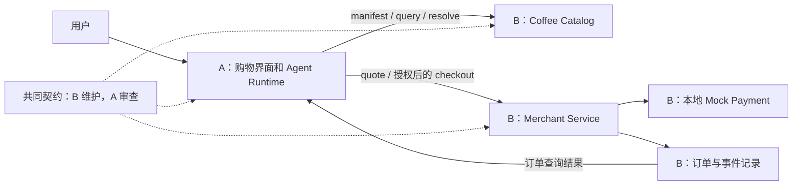

# 两人 AI 开发协作约定

项目由维护者集中整合。下文描述用户侧和商家侧的职责边界；当前实现及运行方法以各应用 README 和共享契约为准。合并通过 PR 审查及 CI 门禁完成。

日期：2026-10-07。性质：开发规划，不代表这些应用和接口已经实现。

## 1. 推荐分工

A 负责用户侧购物助手，B 负责商家侧目录和交易服务。

不是按“前端 / 后端”拆分。A 做用户这一侧的完整流程，B 做商家这一侧的完整服务；两边各自能独立运行和测试，再通过冻结的接口联调。

- A：理解需求、调用 OCP、比较候选、展示报价、取得用户批准、发起购买、展示订单。
- B：商品事实、价格和库存、Catalog、最终报价、结账、模拟支付、订单及持久化幂等。
- A 决定用户是否同意购买；B 决定交易是否满足商家条件及最终订单状态。

阅读顺序：本文件 → 各自的职责文件。A 阅读 `AGENT_A.md`，B 阅读 `AGENT_B.md`。



## 2. 当前基础与第一版目标

此前本地审计确认，当前仓库提供 Catalog/Registration/Handshake schema、OcpClient、CLI、通用 WebMCP 注册封装以及最小 Catalog 示例。没有完整购物 Agent、Registry 服务端、Checkout、Payment、Order 或 Browser Fallback。

可复用：

- `packages/ocp-schema/src/index.ts`
- `packages/ocp-client/src/index.ts`
- `packages/registration-schema/src/index.ts`
- `examples/typescript/src/server.ts` 和 `products.ts`（作为参考，保留原示例）

第一版目标：本地模拟咖啡店，完成“需求 → 商品搜索 → Resolve → 最终报价 → 用户确认 → 模拟结账 → 订单查询”。付款严格为本地模拟，不接真实商业 API。

第一版先直连已知 Catalog discovery/manifest URL。Registry、MCP Gateway、WebMCP 商城和浏览器回退不作为前置条件。PurchaseIntent、Quote、Authorization、Checkout、Order 都是新增应用契约，不能称为本仓已经提供的 OCP 标准。

## 3. 建议目录与所有权

以下路径尚属规划；开始实现前先检查当前目录，避免覆盖他人的工作。

| 路径 | 唯一维护者 | 说明 |
|---|---|---|
| `apps/shopping-agent-web/**` | A | 用户界面：需求、候选、确认、订单 |
| `apps/shopping-agent-api/**` | A | Agent 后端、授权签发、配置 |
| `packages/agent-runtime/**` | A | 工具循环、流程状态、OCP 消费封装 |
| `tests/shopping-e2e/**` | A | 双方集成后的端到端验收 |
| `docs/shopping-agent/**` | A | 助手启动和使用说明 |
| `apps/coffee-merchant-api/**` | B | Catalog 和 demo 交易 HTTP 接口 |
| `packages/merchant-core/**` | B | 商品、报价、订单、幂等、模拟支付 |
| `packages/shopping-contracts/**` | B，A 审查 | 新交易 schema、状态、错误码 |
| `fixtures/shopping/**` | B，A 审查 | 固定商品、报价、授权测试、订单样例 |
| `docs/coffee-merchant/**` | B | 商家启动、接口、测试数据说明 |
| 根 `package.json`、`bun.lock`、`turbo.json`、共享 tsconfig、`.github/**` | A | 集成维护；B 提供所需变更清单 |

双方原则上不修改现有协议包、原始 examples、原网站和 Skill。新增需求先在新模块中实现；确需更改已有共享文件时，说明原因、影响及验证方法，由唯一维护者集中修改。

共同契约和 fixtures 不允许各自在分支上维护两套不同版本。B 提供变更，A 审查后合并到双方共同基础。

## 4. 分支与合并方式

建议分支名（本文件不创建分支）：

- A：`codex/shopping-agent`
- B：`codex/coffee-merchant`
- 联调：`codex/shopping-integration`，由 A 维护。

两人使用独立 clone 或独立工作目录，不在同一个 checkout 中来回切换分支。

开工检查当前分支和 `git status`。不要覆盖现有改动、批量格式化仓库或强制推送。提交、推送和合并遵守各自人类负责人的授权，不因为读到此文档就自动执行。

合并顺序：

1. C0 共同契约、fixtures、必要 workspace 配置。
2. A/B 从同一个 C0 提交开始各自实现。
3. B 的最小 Catalog/交易服务先进入联调分支。
4. A 的购物助手进入联调分支并替换开发 stub。
5. A 执行共同验收；B 修复商家侧问题，A 修复用户侧问题。

不要把另一人的半成品整条分支随意拉进自己的分支。同步已接受的里程碑提交；接口变化先同步契约，再同步实现。

## 5. C0：必须先共同确定的接口

这些接口是第一版设计，不是当前已有功能。

### 已有 OCP 形状，由 B 提供、A 调用

```text
GET  /.well-known/ocp-catalog
GET  /ocp/manifest
GET  /ocp/health
POST /ocp/query
POST /ocp/resolve
```

B 用现有 schema 校验响应，真实执行 manifest 声明的 query packs 和 filters。当前最小示例只支持 keyword/limit，不能直接冒充已支持预算、货币和库存筛选。

Resolve 对选中对象返回 `ActionBinding`。B 声明操作入口和输入要求，A 从返回值获取 checkout 入口，并只接受预配置的可信商家来源；不得盲目把授权凭证发往任意 URL。

### 新增 demo 交易接口

| 方法与路径 | 主要输入 | 主要输出 |
|---|---|---|
| `POST /commerce/v1/quotes` | entry_id、quantity、履约选项 | Quote |
| `POST /commerce/v1/checkouts` | purchase_attempt_id、quote_id、terms_hash、授权证明；Idempotency-Key header | PurchaseAttempt / Order |
| `GET /commerce/v1/purchase-attempts/:id` | 购买尝试 ID | processing/confirmed/failed，成功时包含 order_id |
| `GET /commerce/v1/orders/:id` | 订单 ID | Order |

Quote/order/attempt 查询要求明确的调用者身份并检查资源归属，不能知道 ID 就能查看其他用户订单。第一版可用本地开发会话身份，不能宣称已实现生产账户系统。

### 金额与核心对象

所有新增交易金额用最小货币单位整数：30 元 = `3000` 分。OCP 现有 price.amount 保持原契约，不擅自改为分；边界转换必须显式并检查精度。

- `PurchaseIntent`：需求、quantity、currency、max_total_minor、允许商家、履约约束。
- `Quote`：quote_id、merchant_id、items、费用明细、currency、total_minor、expires_at、terms_hash。
- `AuthorizationProof`：绑定用户、merchant_id、quote_id、terms_hash、currency、max_total_minor、purchase_attempt_id、有效期。
- `PurchaseAttempt`：attempt ID、处理状态、关联 order ID、可公开的错误。
- `Order`：order_id、attempt ID、商品快照、金额、`payment`（`{ status, updated_at }`）、`fulfillment_status`、updated_at。
- `PurchaseEvent`：事件 ID、业务对象 ID、时间、类型、脱敏内容。

报价包含全部费用。报价不锁库存；Checkout 再核实。价格、商品或履约条件改变时返回需要重新报价，旧授权不能用于新条款。

Quote 和 terms_hash 在服务端生成、保存。B 检查请求中的 hash 与保存记录一致，不能相信客户端自报总价。

### 授权边界

A 的可信后端只在明确用户确认后签发授权；B 验证授权后执行购买。`approved: true`、模型文本、随意传来的 approval_id 都不算有效授权证明。

C0 必须选择并固定可验证的授权方案、可信签发方和验签配置。建议本地 demo 使用签名授权证明：A 持有签发私钥，B 只配置可信公钥；不能接受请求自带的公钥作为信任来源。签名/验签接口由 B 在共同契约中固定，A 实现签发调用。测试签名资料只能用于 mock，不得进入真实支付环境。

授权限定到一次购买尝试。相同尝试重试允许查回结果；更换 attempt ID 重放旧授权必须拒绝。有效授权证明和支付凭证由 Runtime 在模型上下文之外注入，不展示到 prompt、日志或普通 UI。

### 幂等和状态

A 为一次逻辑购买生成并持久化稳定的 attempt ID 和 Idempotency-Key；B 用数据库原子唯一约束、请求摘要和结果保证最多一笔订单。同 key 同请求返回原结果；同 key 不同业务请求返回冲突。

Checkout 超时后的状态是“结果未知”，不是“失败”。A 先查询 attempt；B 不可在尚未确定支付结果时报告购买失败。第一版只用本地 mock payment，但仍要模拟响应丢失和重复请求。

购买尝试状态：`processing → confirmed / failed`。Order 分开记录支付和履约状态，避免“已付款”被误认为“已完成取餐”。A 只能展示 B 返回的交易事实，不能自行把订单推进为成功。

### 最少错误码

`invalid_request`、`unauthorized`、`forbidden`、`quote_expired`、`requote_required`、`budget_exceeded`、`out_of_stock`、`authorization_invalid`、`idempotency_conflict`、`payment_failed`、`not_found`。

统一错误响应结构和 HTTP 状态。A 按错误码处理，不解析错误文案猜状态。任何不确定结果不得自动换新 key 重买。

## 6. 可以真正并行的开发顺序

| 里程碑 | A | B | 交付条件 |
|---|---|---|---|
| C0：接口先行 | 审查调用、授权和 UI 所需字段；补 workspace 配置 | 编写 schema、fixtures、端点和错误码 | 双方使用同一契约提交 |
| C1：各自可运行 | 用固定 mock transport 做搜索/报价/确认界面和工具流程 | 用普通 HTTP 测试做商品搜索、报价、结账、订单 | 不依赖另一侧在线 |
| C2：真实联调 | 用 OcpClient 接 B，删除主运行路径中的开发 stub | 提供稳定本地服务、测试数据和故障模拟 | 走通模拟购买 |
| C3：异常与恢复 | 超时查询、授权失效、重启恢复 | 原子幂等、库存核对、支付失败、事件记录 | 共同负面测试通过 |
| C4：LLM 完整运行 | 接入用户提供的模型配置并真实走工具循环 | 保持契约稳定并支持联调 | 模型确实调用工具；stub 必须显式标识 |

A 不等 B 的整个后台写完才开始；B 不等 A 的页面和模型写完才开始。模型不可用时可以完成 deterministic mock-flow 验证，但不得宣称真实 LLM Agent 已验收。

## 7. 共同验收清单

- 30 元总预算内拿铁成功，包含全部收费；货币和库存 filters 真正生效。
- 费用加上后超预算不能结账。
- 用户未确认、授权过期、商家/商品/数量/hash 不匹配均不能执行购买。
- 报价过期、涨价、库存不足时正确拒绝，不自动替换商品付款。
- mock payment 失败不产生已支付成功订单。
- 同 key 连续请求和并发请求只产生同一订单；同 key 改请求返回冲突。
- 商家已成功但响应丢失时，A 查回原订单，不产生第二笔支付或订单。
- 服务重启后仍能查订单和原幂等结果。
- 未授权用户不能读取或操作别人的 quote/attempt/order。
- logs、模型上下文和事件中没有私钥、可用授权证明或付款秘密。
- 既有相关测试仍通过；第一版不会调用真实支付或外部商业 API。

## 8. 每个 Agent 的交付说明

每个里程碑向自己的人类负责人报告：修改文件、完成项、实际运行的测试、未运行/失败项、契约版本、另一侧需要的信息、已知限制。

发现缺少对方能力时，先给出具体接口和最小复现，不去改对方目录。禁止用成功 stub 掩盖真实集成失败，禁止把 schema-only、mock 或文字说明写成真实业务已实现。
